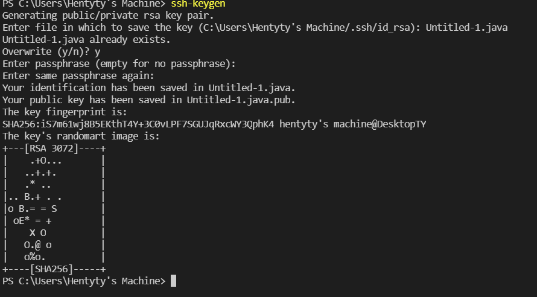

# How To Log Into a Couse-Specific Account on ieng6

## Quick links
(insert step 1) etc


## Step 1: Installing VS Code

1. Firstly, you must download and install [VSCode](https://code.visualstudio.com/Download) to be able to connect.
2. Choose which operating system you use and follow the instructions to install.
------------------------------------------------------------
------------------------------------------------------------
------------------------------------------------------------
## Step 2: Remotely Connecting
1. Windows users should firstly download [OpenSSH](https://docs.microsoft.com/en-us/windows-server/administration/openssh/openssh_install_firstuse).
2. Next, look up your course-specific account [here](https://sdacs.ucsd.edu/~icc/index.php). (Should be similar to cs15lwi22abe).
3. Open VSCode and select **Terminal**->**New Terminal**.
4. Within the terminal, input:
`ssh cse15lwi22abe@ieng6.ucsd.edu` (switched with your specific account) and input password.
5. Answer yes if prompted.

6. If something similar comes up then you will be connected!
---
---
---
## Step 3: Trying Commands
1. Try inputing *`cd, ls, pwd, mkdir, cp`* in the terminal.
2. Once you're satisfied, to exit input *`exit`*.
3. **Example**:

* What do you think *`ls`* does? (Hint: lists)
---
---
---
## Step 4: Moving Files (SCP)
1. Make sure you are not still within **ieng6**.
2. Create a file and add some kind of code to run on the server.
3. From the directory where you created this file, input:
`scp TestFile.java cs15lwi22abe@ieng6.ucsd.edu:~/`
4. Enter your password.
5. Connect back to ieng6.
6. Input *`ls`* to check that the file is within the directory.
7. After, inputing *`javac`* then *`java`* will run the code on the server!
8. **Example**:

* **Code Transfered**
```
class WhereAmI {
  public static void main(String[] args) {
    System.out.println(System.getProperty("os.name"));
    System.out.println(System.getProperty("user.name"));
    System.out.println(System.getProperty("user.home"));
    System.out.println(System.getProperty("user.dir"));
  }
}
```
------------------------------------------------------------
---
---
## Step 5: Setting an SSH Key
* Logging in and running scp is time consuming due to having to input your password every time. To get around this you can use ssh keys that create a public and private key that can be used with *`ssh`* in place of your password.
1. Set up by inputing *`ssh-keygen`*. 
**Example**:

* This creates the private key saved within file `id_rsa` and the public key to the `id_rsa.pub` file.
2. Next copy the public key to the .ssh directory of your user account on the server.
**Example**: 
```
(on server)
mkdir .ssh
exit
scp /Users/Machine/.ssh/id_rsa.pub cs15lwi22@ieng6.ucsd.edu:~/.ssh/authorized_keys
```
3. After, you should be able to ssh and scp without using a password!
---
---
---
## Step 6: Optimizing (Editing and Uploading a File)
1. The best way of optimization, in my opionion, is to deffinitely to set up an ssh key to knock off the time that it takes to input your password.
2. Then to also cut down on time, you can press the "up" arrow on your keyboard to automatically paste previous commands.

* To optimize uploading and running a file on the server, I would firstly do whatever edit I wanted then upload via scp(key gen auto). Still within the client, I would also input: 
`ssh cs15lwi22@ieng6.ucsd.edu "cp File.java"`
Which logs into the server, runs the input, and exits.
