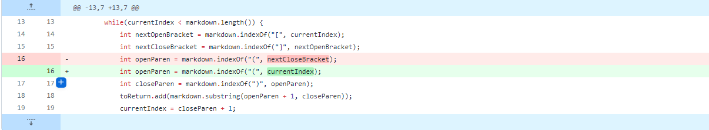
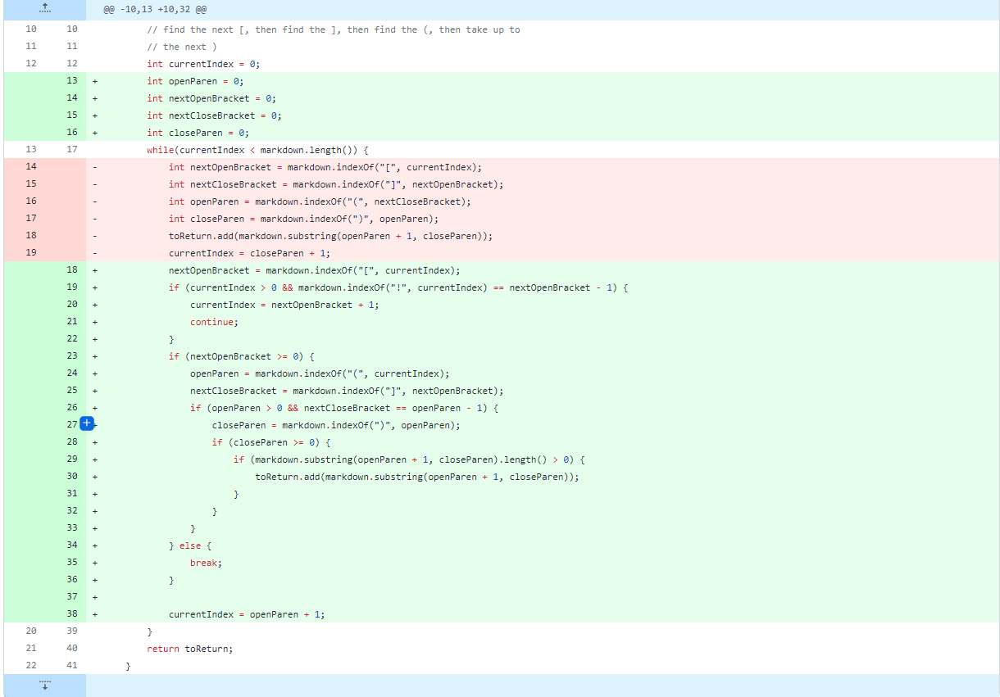

<<<<<<< HEAD
# Week 4 Lab Report (2)
---

[Test File Causing Failure](https://github.com/tylermeyers/markdown-parse/blob/20b1a762f348960b61de05ca8695c444d933dd13/test-file.md)
```
[https://something.com, , some-page.html]
```

The failure-inducing input caused the program to output an empty link, which we do not wish to happen. The bug caused the symptom as the code for finding the open paranthesis was based off of the next closed bracket and not the index.

---


[Test File Causing Failure](https://github.com/tylermeyers/markdown-parse/blob/884faf2b1d52d800e117b54e5c7cbaa3a0d5b2ec/test-file2.md)
```
Exception in thread "main" java.lang.OutOfMemoryError: Java heap space
        at java.base/java.lang.StringLatin1.newString(StringLatin1.java:769)
        at java.base/java.lang.String.substring(String.java:2709)
        at MarkdownParse.getLinks(MarkdownParse.java:18)
        at MarkdownParse.main(MarkdownParse.java:26)
```
The failure inducing input causes a never-ending while loop that had caused the OutOfMemoryError error. This had happened because there was an open "[" and the program was continuously searching for the closed "]", but never found it and continued.

---
