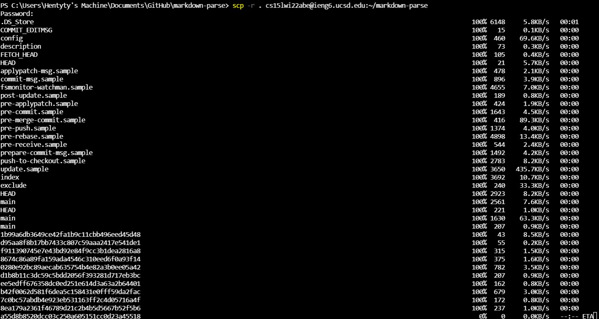
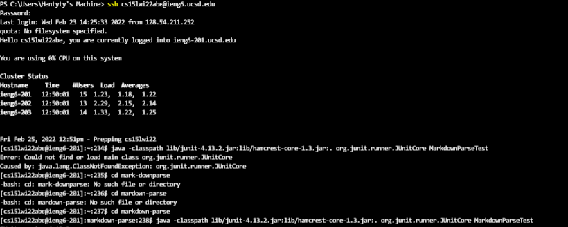
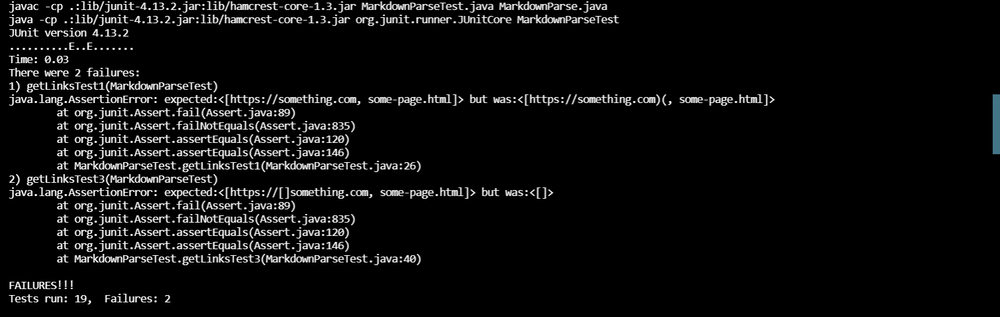
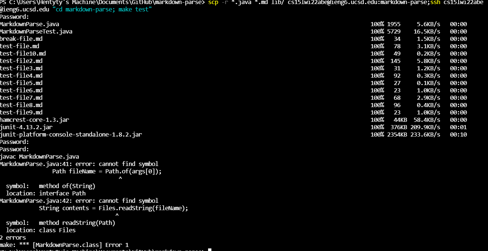

# Week  Lab Report (3)

## scp'ing into ieng6

## Running on server

## one line upload and run

It tecnically does go in and run the makefile but the output isn't correct and I have no idea why. It works when I ssh then run it on different lines, but I guess I'll just have to take the 0 on this :/