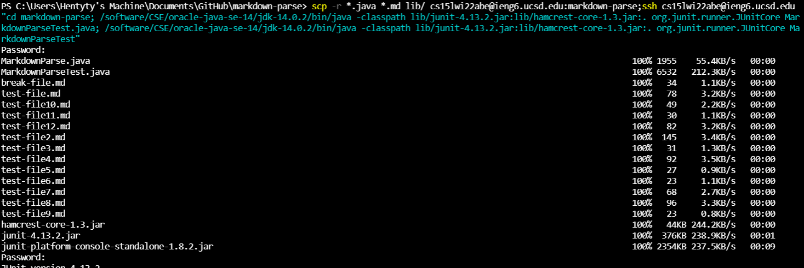
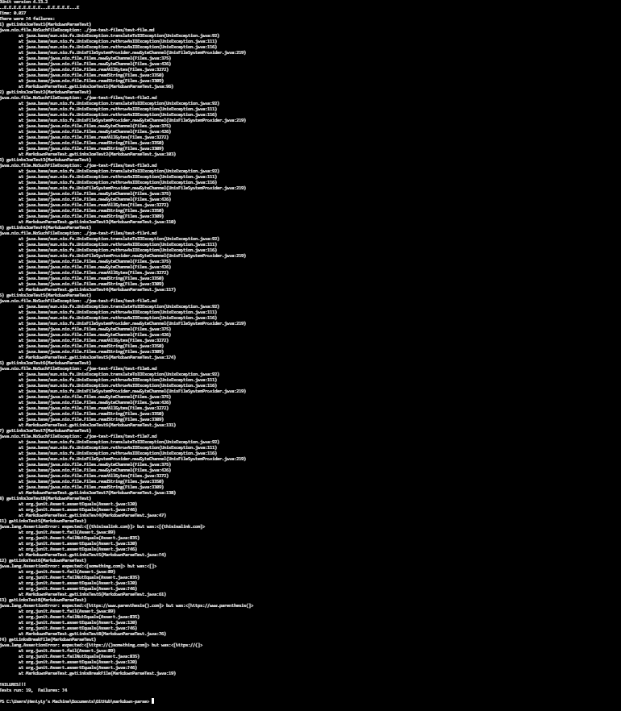

# Week  Lab Report (3)

## scp'ing into ieng6

## Running on server

## one line upload and run
With this command...

I got this output, but I'm not sure if this is "acceptable" as my MarkdownParse is faulty somehow.

