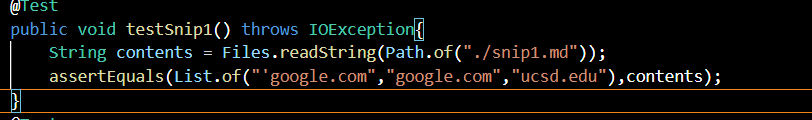
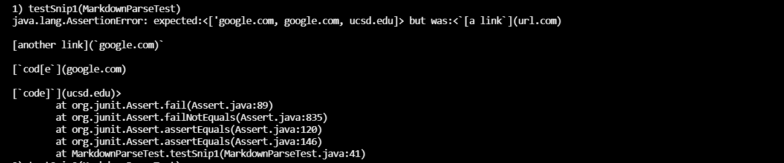
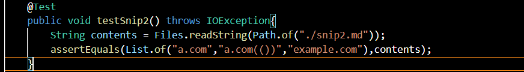
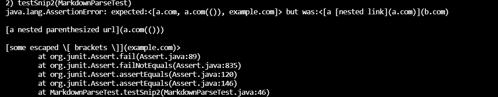
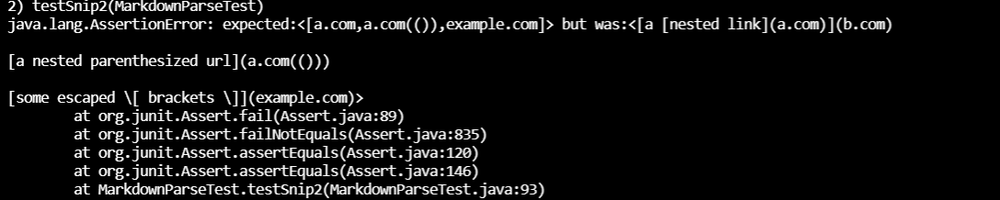
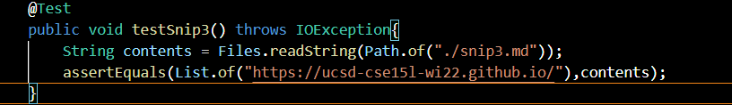
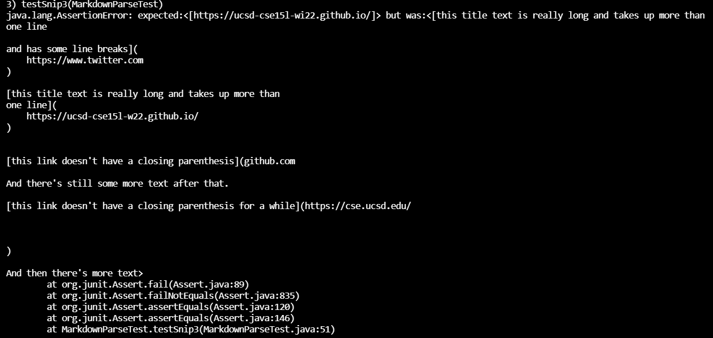
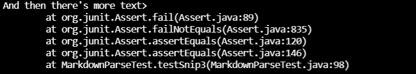

# Week 8 Lab Report

[My Repo](https://github.com/tylermeyers/markdown-parse/blob/main/MarkdownParse.java)

[Other Repo](https://github.com/ShashankVenkatramani/markdown-parse/)

---
## Snippet 1
---
Expected:
`['google.com,google.com,ucsd.edu]`

Output(fail):

Other MarkdownParse

---
## Snippet 2
---
Expected:
`[a.com,a.com(()),example.com]`

Output(fail):

Other MarkdownParse

---
## Snippet 3
---
Expected:
`[https://ucsd-cse15l-wi22.github.io/]`

Output(fail):

Other MarkdownParse

