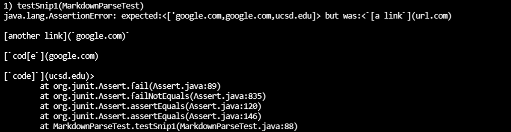

# Week 8 Lab Report

[My Repo](https://github.com/tylermeyers/markdown-parse/blob/main/MarkdownParse.java)

[Other Repo](https://github.com/ShashankVenkatramani/markdown-parse/)

---
## Snippet 1
---
Expected:
`['google.com,google.com,ucsd.edu]`

Output(fail):

Other MarkdownParse

---
## Snippet 2
---
Expected:
`[a.com,a.com(()),example.com]`

Output(fail):

Other MarkdownParse

---
## Snippet 3
---
Expected:
`[https://ucsd-cse15l-wi22.github.io/]`

Output(fail):

Other MarkdownParse

----------
1. I don't believe there would be a less than 10 line change I could do to have the test pass. I think that due to the nature of backticks, that they turn whatever is within into code, making a small change that accounts for the variability of the usage would not be possible. It would have to account for the number of backticks, their position, which ones connect, etc.

2. I also think that a more involved change would be needed to account for nested paraentheses, brackets, and escaped brackets. Similarly to backticks, I think the program would need to keep track of the number of each, see where each connect, and figure out what is an acceptable link. Something that I don't believe is possible in under 10 lines.

3. I think that a small code change would yet again be impossible but being due to my code being really messed up. At the stage that this was tested, I believe I would probably have to do more than 10 lines with most changes considering that the output is really incorrect. Though I do think that a small change in a mostly-working markdown-parse could be done within 10 lines of code; you would probably only need to add an if statement that checks if there is a line break between brackets, an if statement that checks if the text within paranthesis does not occur outside of one line break, and something that would format the link so that there would not be a bunch of spaces.
