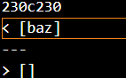
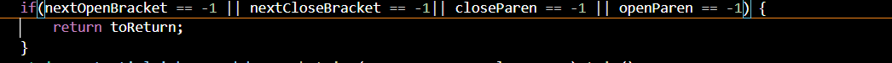

# Week 10 Lab Report
---

To find the differing results, I used the `diff` command to compare the given and my groups `markdown-parse`; I then put the results into a new file via output direction(`>`). I found the tests by just manually going to see which tests were producing the differences.

## Difference 1(201.md)
---
Output(first = provided, second = group):

Expected: Nothing (provided has a bug)

The issue with the provided is that in the if statement, it only checks whether or not each was found. It doesn't take into account whether the position of the () are in the correct spot

---